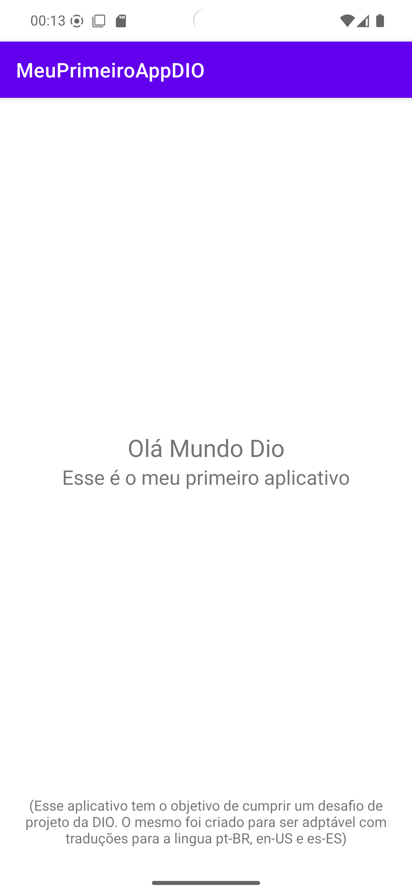

# Meu Primeiro App DIO

<p align="center">
  
</p>

---

## 📱 Sobre o projeto
Aplicativo Android desenvolvido utilizando **Kotlin** e **View System tradicional** (XML).
Aplicação Android simples que exibe um texto centralizado utilizando Views tradicionais.

---

## 🛠 Tecnologias Utilizadas
- Kotlin
- Android SDK
- View System (Layout XML)
- Android Studio

---

## ✨ Funcionalidades
- TextView com texto centralizado
- Internacionalização de strings
- Configuração de tema e estilo

---

## 🚀 Como Executar o Projeto

```bash
git clone https://github.com/PedroThiago02/Meu-Primeiro-App-DIO.git
```

Abra o Android Studio → Importe o projeto → Rode no dispositivo físico ou emulador.

---

## 📸 Screenshots

| Tela Inicial | Tela em Inglês | Tela em Espanhol |
|:------------:|:--------------:|:--------------:|
|  |  |  |

---

## 🌍 Internacionalização

```xml
<!-- res/values/strings.xml -->
<resources>
    <string name="app_name">Meu Primeiro App DIO</string>
    <string name="hello_world">Olá Mundo!</string>
</resources>
```

```xml
<!-- res/values-en/strings.xml -->
<resources>
    <string name="app_name">My First App DIO</string>
    <string name="hello_world">Hello World!</string>
</resources>
```

---

## 🤝 Contribuindo

Contribuições são bem-vindas!  
Abra uma issue ou envie um Pull Request 🚀

---

Desenvolvido por [PedroThiago02](https://github.com/PedroThiago02)
